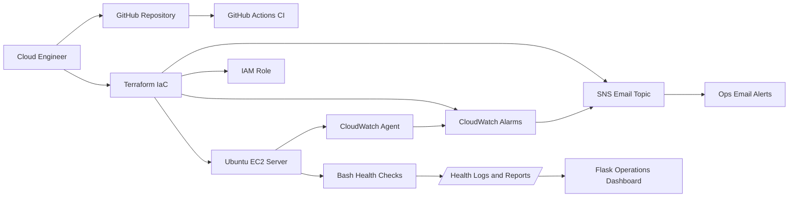

# MedCare Ubuntu Operations & Monitoring Platform

Real-world cloud engineering portfolio project for **MedCare Health Services**, a healthcare company that needs better visibility into Ubuntu servers running internal applications.

The platform provisions an Ubuntu EC2 instance, installs monitoring dependencies, collects Linux health data, sends CloudWatch alarms through SNS email, and exposes a Dockerized operations dashboard for support engineers.


## Business Problem

MedCare's operations team supports multiple Ubuntu servers but lacks a central view of:

- CPU, memory, and disk usage
- Service status for critical Linux services
- Log growth and retention
- CloudWatch alarms and email notifications
- Daily server health evidence for support handovers

## Solution

This project delivers a centralized Ubuntu Operations & Monitoring Platform using AWS, Terraform, Bash, Python, CloudWatch, SNS, Docker, and GitHub Actions.

## Architecture



## Features

- Terraform infrastructure deployment
- Ubuntu EC2 server provisioning
- IAM role for SSM and CloudWatch Agent
- CPU, memory, disk, and EC2 status alarms
- SNS email alerts
- Bash-based health checks
- Automated log cleanup
- Daily report-ready JSON output
- Flask operations dashboard
- Dockerized dashboard runtime
- GitHub Actions CI for Terraform, Python tests, and Docker build

## Technology Stack

| Area | Tools |
| --- | --- |
| Cloud | AWS EC2, IAM, CloudWatch, SNS |
| Infrastructure | Terraform |
| Operating System | Ubuntu Server |
| Automation | Bash, cron |
| Application | Python, Flask, Gunicorn |
| Containers | Docker, Docker Compose |
| CI/CD | GitHub Actions |
| Version Control | Git, GitHub |

## Repository Structure

```text
.
├── app/                    # Flask monitoring dashboard
├── docs/                   # Architecture, deployment, screenshots, runbooks
├── scripts/                # Ubuntu health checks, cleanup, install, deploy
├── terraform/              # AWS infrastructure as code
├── tests/                  # Python tests
├── .github/workflows/      # CI pipeline
├── Dockerfile
├── docker-compose.yml
└── README.md
```

## Local Dashboard Demo

Run the dashboard locally with sample data:

```bash
python -m venv .venv
source .venv/bin/activate
pip install -r app/requirements.txt
cd app
python app.py
```

Open:

```text
http://localhost:5000
```

Or run with Docker:

```bash
docker compose up --build
```

## AWS Deployment

1. Copy the Terraform example variables:

```bash
cd terraform
cp terraform.tfvars.example terraform.tfvars
```

2. Edit `terraform.tfvars`:

```hcl
aws_region  = "us-east-1"
alert_email = "your-email@example.com"
key_name    = "your-existing-keypair-name"
ssh_cidr    = "YOUR_PUBLIC_IP/32"
```

3. Deploy infrastructure:

```bash
terraform init
terraform fmt
terraform validate
terraform plan
terraform apply
```

4. Confirm the SNS subscription email from AWS.

5. Deploy the app and scripts to EC2:

```bash
./scripts/deploy_to_ec2.sh <EC2_PUBLIC_IP> <PATH_TO_PRIVATE_KEY.pem>
```

6. Open the dashboard URL from Terraform output.

## Validation

Run local checks:

```bash
pytest -q
terraform -chdir=terraform fmt -check
terraform -chdir=terraform init -backend=false
terraform -chdir=terraform validate
docker build -t medcare-dashboard:local .
```

## Cost Control

This project is designed for low-cost portfolio use:

- Use `t3.micro` where free tier or low-cost eligible.
- Keep one EC2 instance only.
- Destroy resources when not testing:

```bash
terraform destroy
```

## Screenshots To Add

Add these screenshots to `docs/screenshots/`:

- `dashboard-local.png`
- `terraform-apply.png`
- `cloudwatch-alarms.png`
- `sns-email-confirmation.png`
- `github-actions-ci.png`

## Interview Talking Points

- How Terraform provisions repeatable AWS infrastructure
- Why CloudWatch Agent is needed for memory and disk metrics
- How SNS turns CloudWatch alarms into email alerts
- How Bash scripts support Linux operations workflows
- How Docker makes the dashboard portable
- How GitHub Actions validates infrastructure and application changes

## Skills Demonstrated

Linux administration, Ubuntu operations, AWS infrastructure, monitoring, alerting, Bash automation, Python backend development, Docker, Terraform, CI/CD, and production-style documentation.
