# MedCare Ubuntu Operations & Monitoring Platform

[](https://github.com/ucfavour23/medcare-ubuntu-ops-monitoring/actions/workflows/ci.yml)

MedCare Ubuntu Operations & Monitoring Platform provides health visibility, alerting, and operational evidence for Ubuntu servers that support internal healthcare applications.

The platform provisions an Ubuntu EC2 instance, installs monitoring dependencies, collects Linux health data, sends CloudWatch alarms through SNS email, and exposes a Dockerized operations dashboard for support engineers.

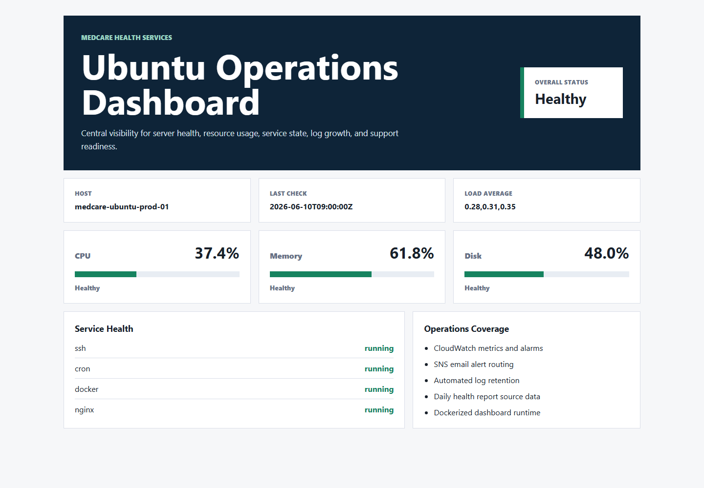

## Business Problem

MedCare's operations team supports multiple Ubuntu servers but lacks a central view of:

- CPU, memory, and disk usage
- Service status for critical Linux services
- Log growth and retention
- CloudWatch alarms and email notifications
- Daily server health evidence for support handovers

## Solution

The platform combines AWS infrastructure, Linux automation, CloudWatch monitoring, SNS alerting, a Flask dashboard, Docker packaging, and CI validation into one repeatable operations workflow.

## Architecture

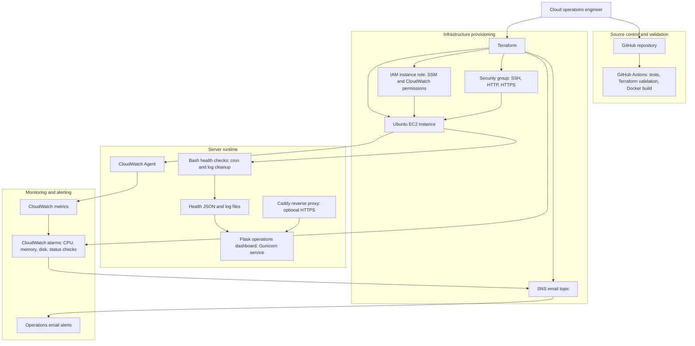

## Features

- Terraform infrastructure deployment
- Ubuntu EC2 server provisioning
- IAM role for SSM and CloudWatch Agent
- CPU, memory, disk, and EC2 status alarms
- SNS email alerts
- Bash-based health checks
- Automated log cleanup
- Daily report-ready JSON output
- Flask operations dashboard
- Dockerized dashboard runtime
- GitHub Actions CI for Terraform, Python tests, and Docker build

## Technology Stack

| Area | Tools |
| --- | --- |
| Cloud | AWS EC2, IAM, CloudWatch, SNS |
| Infrastructure | Terraform |
| Operating System | Ubuntu Server |
| Automation | Bash, cron |
| Application | Python, Flask, Gunicorn |
| Containers | Docker, Docker Compose |
| CI/CD | GitHub Actions |
| Version Control | Git, GitHub |

## Repository Structure

```text
.
app/                    # Flask monitoring dashboard
docs/                   # Architecture, deployment, screenshots, runbooks
scripts/                # Ubuntu health checks, cleanup, install, deploy
terraform/              # AWS infrastructure as code
tests/                  # Python tests
.github/workflows/      # CI pipeline
Dockerfile
docker-compose.yml
README.md
```

## Local Dashboard Demo

Run the dashboard locally with sample data:

```bash
python -m venv .venv
source .venv/bin/activate
pip install -r app/requirements.txt
cd app
python app.py
```

Open:

```text
http://localhost:5000
```

Or run with Docker:

```bash
docker compose up --build
```

## AWS Deployment

1. Copy the Terraform example variables:

```bash
cd terraform
cp terraform.tfvars.example terraform.tfvars
```

2. Edit `terraform.tfvars`:

```hcl
aws_region    = "us-east-1"
alert_email   = "your-email@example.com"
key_name      = "your-existing-keypair-name"
ssh_cidr      = "YOUR_PUBLIC_IP/32"

# Optional for a secure public dashboard.
dashboard_domain   = "ops.example.com"
certificate_email = "your-email@example.com"
```

3. Deploy infrastructure:

```bash
terraform init
terraform fmt
terraform validate
terraform plan
terraform apply
```

4. Confirm the SNS subscription email from AWS.

5. Deploy the app and scripts to EC2:

```bash
./scripts/deploy_to_ec2.sh <EC2_PUBLIC_IP> <PATH_TO_PRIVATE_KEY.pem>
```

6. Open the dashboard URL from Terraform output.

### HTTPS Dashboard

Browsers mark `http://<public-ip>:5000` as not secure because it is plain HTTP and has no trusted TLS certificate. For a secure public demo, use a real domain or subdomain:

1. Create an A record for the domain that points to the EC2 public IP.
2. Set `dashboard_domain` and `certificate_email` in `terraform.tfvars`.
3. Run `terraform apply` again.
4. Use the `dashboard_url` Terraform output, which becomes `https://<dashboard_domain>`.

When `dashboard_domain` is set, Caddy is installed as a reverse proxy, Let's Encrypt issues the certificate, and the Flask dashboard listens only on localhost behind HTTPS.

## Validation

Run local checks:

```bash
python -m pytest -q
terraform -chdir=terraform fmt -check
terraform -chdir=terraform init -backend=false
terraform -chdir=terraform validate
docker build -t medcare-dashboard:local .
```

On Windows, the helper script uses a workspace-local Docker config directory so Docker does not read a blocked home-directory config file:

```powershell
.\scripts\verify_local.ps1
```

## Project Evidence

The repository includes validation and deployment screenshots in `docs/screenshots/`:

| Evidence | Screenshot |
| --- | --- |
| Local operations dashboard |  |
| Dashboard health API | 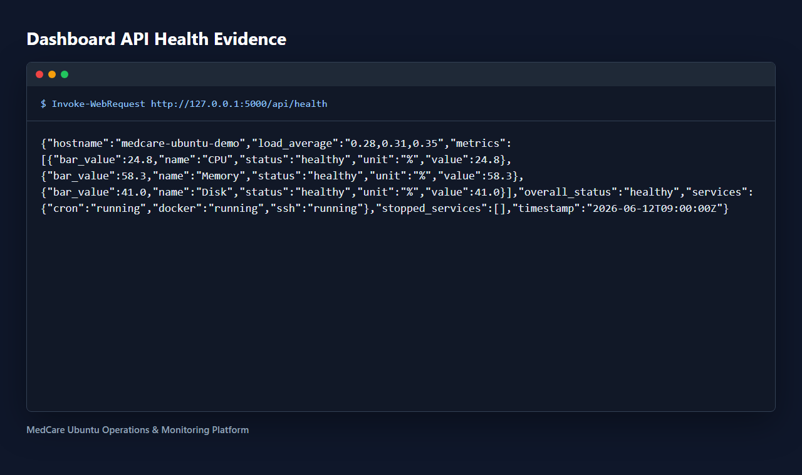 |
| Python test suite | 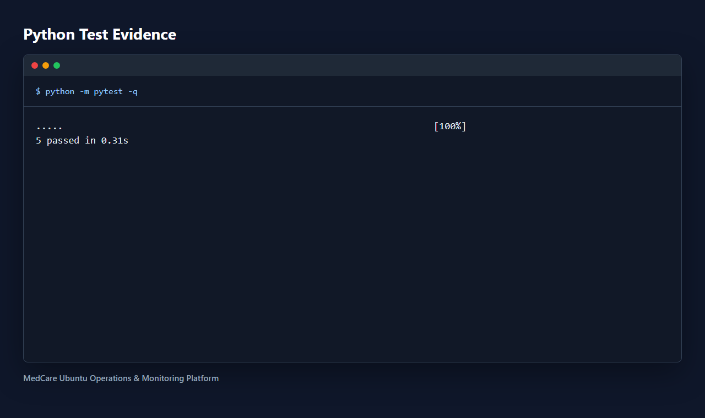 |
| Terraform validation | 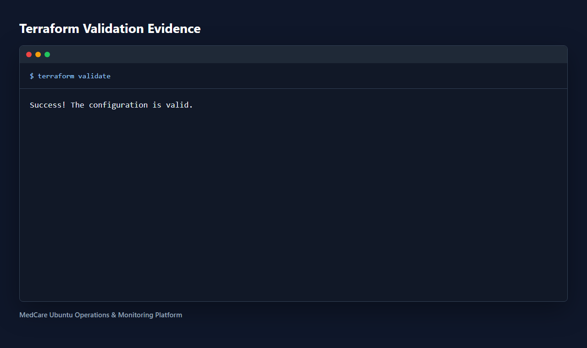 |
| Docker image build | 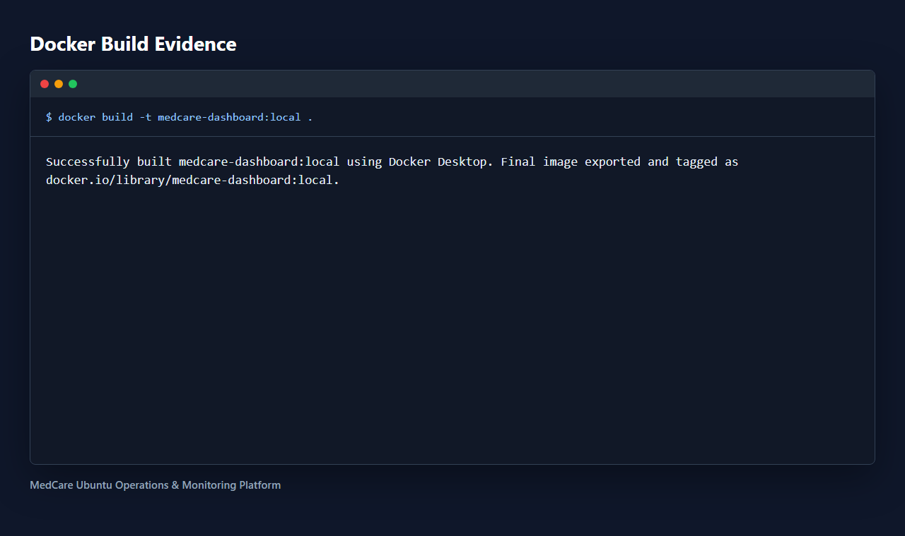 |
| Terraform apply | 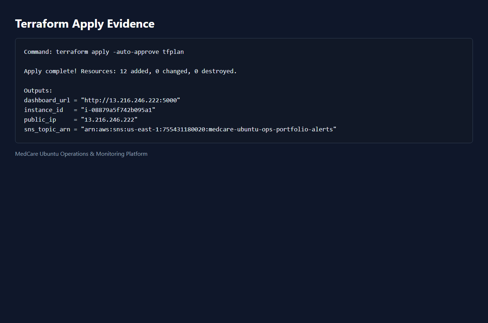 |
| CloudWatch alarms | 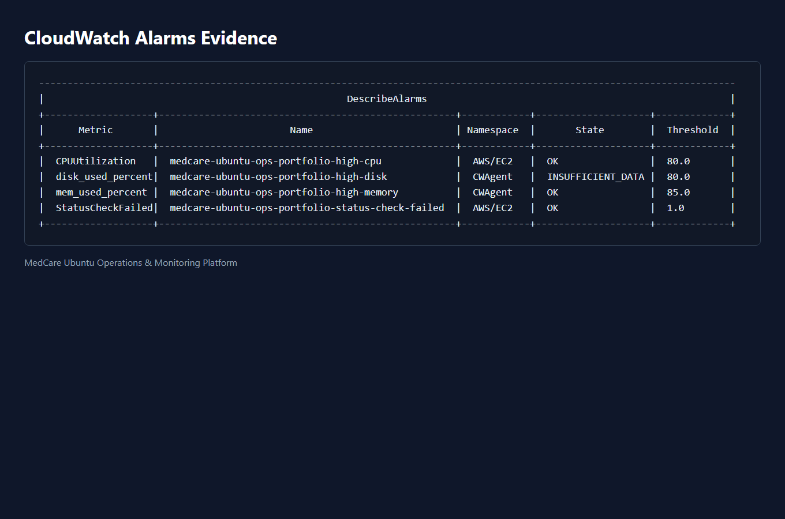 |
| SNS email subscription | 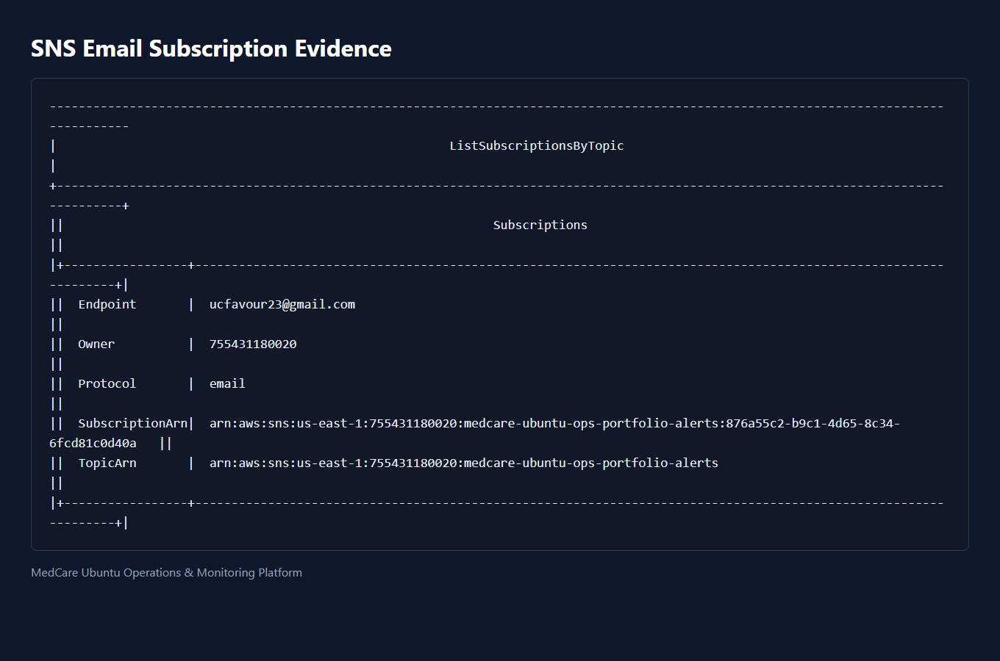 |
| Live EC2 dashboard | 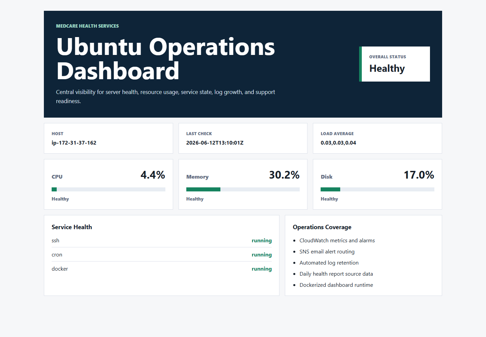 |
| EC2 systemd status | 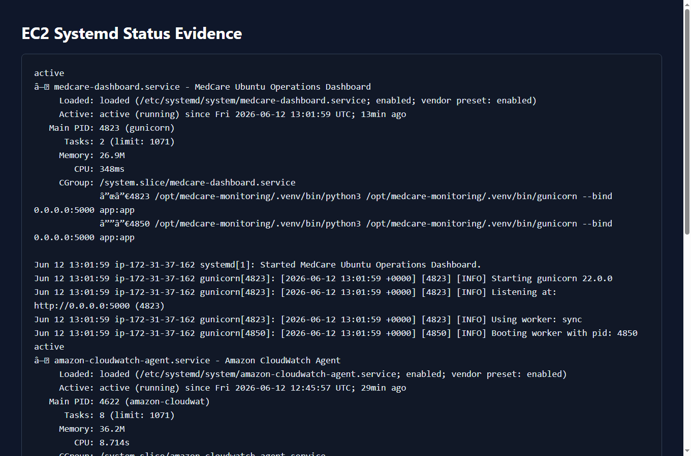 |
| GitHub Actions workflow | 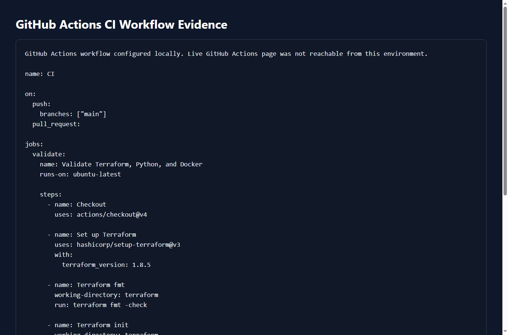 |

See [project completion notes](docs/project-completion.md) for the final verification status and remaining deployment handoff items.

## Cost Control

This deployment is intentionally small, but AWS resources can still create charges:

- Use `t3.micro` where free tier or low-cost eligible.
- Keep one EC2 instance only.
- Destroy resources when not testing:

```bash
terraform destroy
```

## Skills Demonstrated

Linux administration, Ubuntu operations, AWS infrastructure, monitoring, alerting, Bash automation, Python backend development, Docker, Terraform, CI/CD, and production-style documentation.
