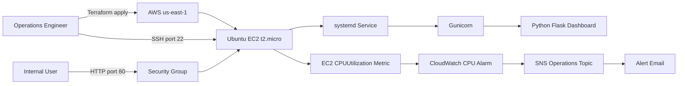

# Architecture

The MedCare Ubuntu Operations & Monitoring Platform uses a small AWS footprint that is easy to understand and inexpensive to demonstrate. The deployment runs natively on Ubuntu with Python, Gunicorn, and systemd.

## Component Responsibilities

| Component | Responsibility |
| --- | --- |
| Terraform | Provisions the EC2 instance, security group, SNS topic, subscription, and CloudWatch alarm. |
| Ubuntu EC2 | Hosts the operations workload and provides the monitored system metrics. |
| systemd | Keeps the Python dashboard running after boot and restarts it if it exits. |
| Flask and psutil | Display hostname, time, CPU, memory, disk, uptime, and process health, with a JSON metrics endpoint. |
| Bash scripts | Provide command-line health, disk, and log maintenance tools. |
| CloudWatch | Watches the native EC2 CPU metric and changes alarm state when usage is high. |
| SNS | Sends alarm notifications to a confirmed email subscriber. |
| GitHub Actions | Checks Python tests, shell syntax, Terraform formatting, and Terraform validation. |

## Security Notes

- No AWS credentials are stored in this repository.
- Restrict `ssh_allowed_cidr` to the administrator's public IP address with a `/32` mask.
- Restrict `http_allowed_cidr` if the dashboard should only be viewed from a trusted network.
- The EC2 instance requires IMDSv2 and uses an encrypted root volume.
- HTTP is intentionally used for a simple demonstration. A production deployment should use HTTPS behind an Application Load Balancer or reverse proxy.
